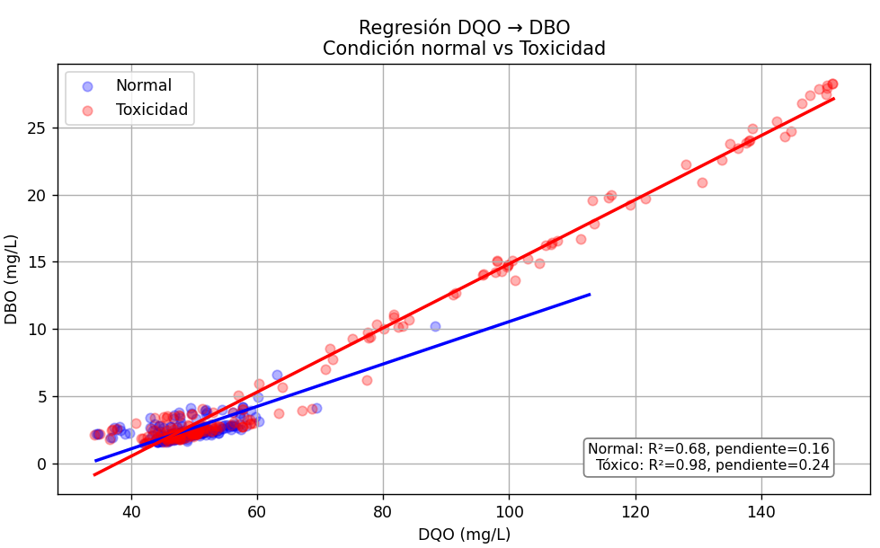
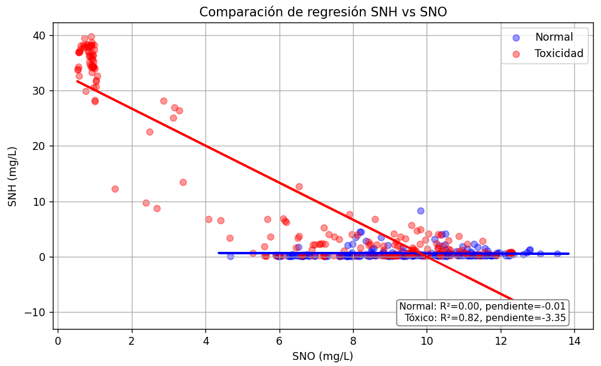
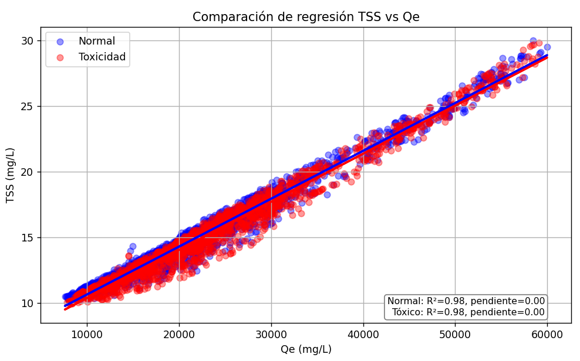
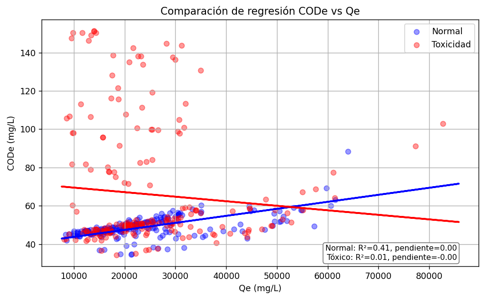
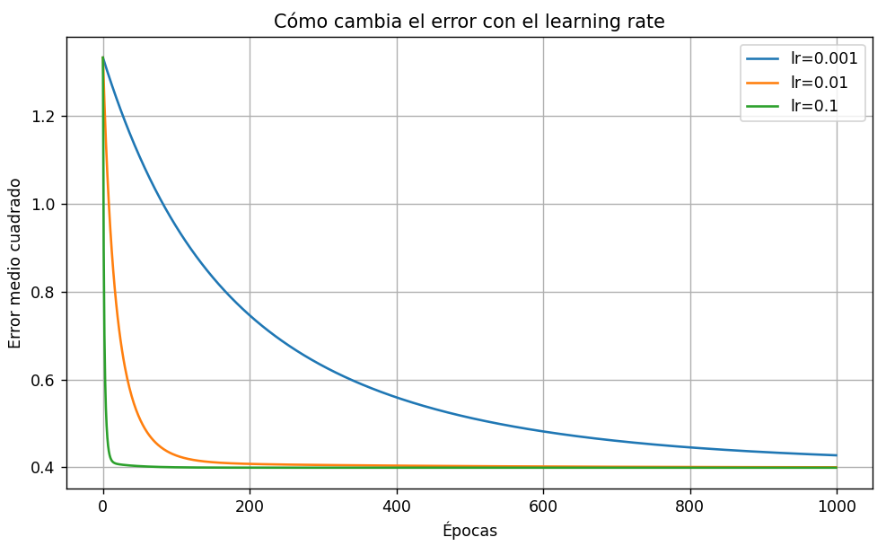
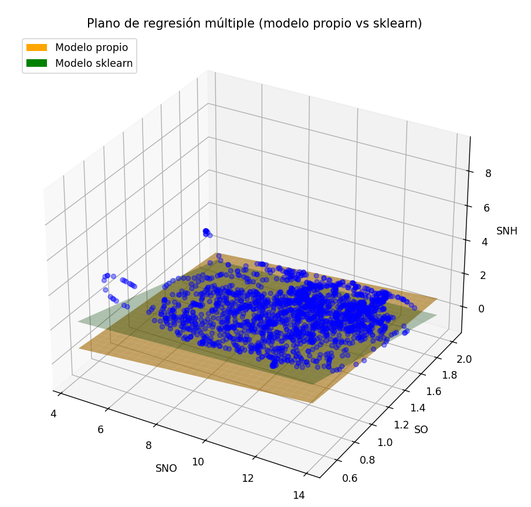
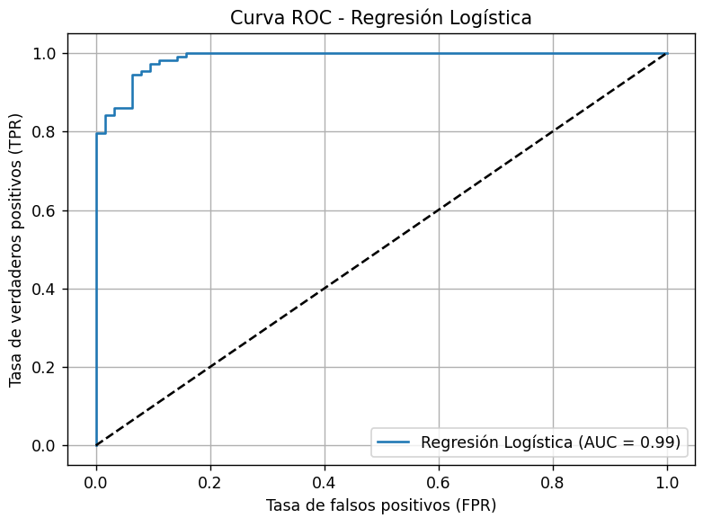
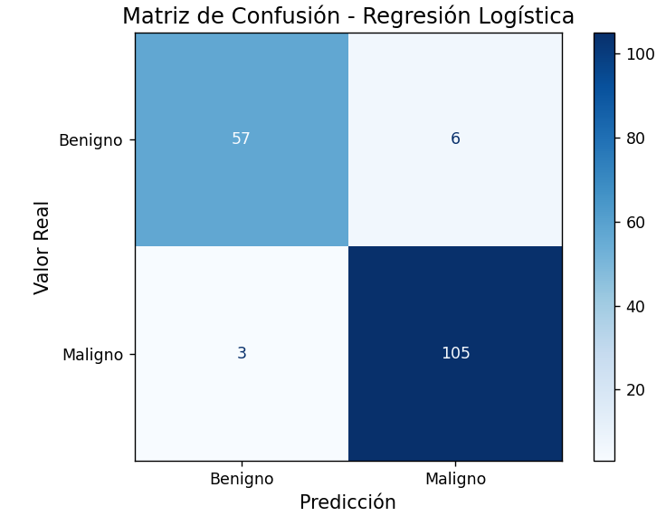
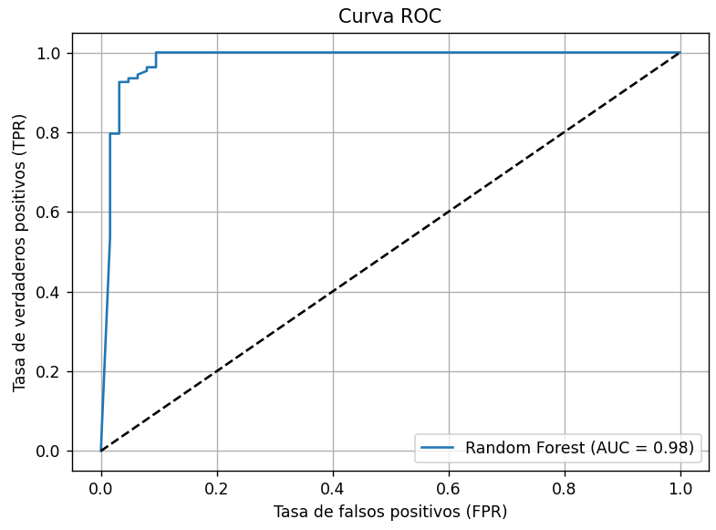
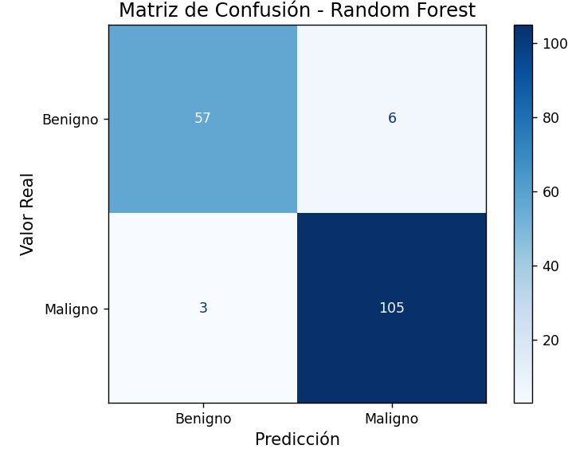

# Ejercicios de Regresión y Clasificación - BSM2

## Ejercicio 1: Regresión Lineal Simple en el BSM2

**Condiciones:**
- 🟦 Simulación sin fallo (condición normal)
- 🔴 Simulación con fallo por toxicidad.

---

### 🔍 Variables estudiadas

| Variable X (predictora) | Variable Y (respuesta) | Fuente de datos |
|------------------------|-----------------------|----------------|
| SNO (nitrato)          | SNH (amonio)          | efluente       |
| DQO (TCOD)             | DBO (BOD5)            | efluente       |
| Qe (caudal efluente)   | TSS (sólidos totales) | efluente       |
| Qe (caudal efluente)   | COD (DQO)             | efluente       |

---

### ⚙️ Tecnología usada

- **MATLAB**: generación de CSV desde simulaciones del BSM2
- **Python**: regresiones con `scikit-learn`, `matplotlib`, `pandas`

---

### 📌 Observaciones

- Se filtran outliers en algunas gráficas (por ejemplo, Qe > 60.000 m³/d)
- Se controla el número de puntos graficados aplicando un muestreo aleatorio del 1% (`frac=0.01`) o del 0,1% (`frac=0.001`)

---

## 📊 Resultados y conclusiones

### 1. DQO → DBO (efluente)

- **R² sin fallo**: 0.6754  
- **R² con toxicidad**: 0.9835

**Conclusión técnica:**  
Cuando el sistema opera con normalidad, los microorganismos degradan parte de la DBO, lo que introduce variabilidad en su relación con la DQO.  
Bajo condiciones de toxicidad, la DBO permanece proporcional a la DQO.

---

### 2. SNH ↔ SNO (efluente)

- **R² sin fallo**: 0.0007  
- **R² con toxicidad**: 0.8174

**Conclusión técnica:**  
En condiciones normales, no hay relación lineal aparente.  
Con toxicidad, hay una clara relación inversa.

---

### 3. Qe ↔ TSS (efluente)

- **R² sin fallo**: 0.9762  
- **R² con toxicidad**: 0.9752  
- **Pendiente**: 0.0004 en ambos casos

---

### 4. Qe ↔ COD (efluente)

- **Tendencia**: leve crecimiento en ambos casos

---

## Ejercicio 2: Regresión Múltiple en el BSM2

Este ejercicio implementa una regresión múltiple usando NumPy desde cero y la compara con `sklearn.linear_model.LinearRegression`.

---

### 🎯 Objetivos

- Programar la función `regresion_lineal_simple` usando gradiente descendente.
- Evaluar el ajuste comparando con `sklearn`.
- Observar la evolución del error y representar gráficamente los resultados.

---

### 📉 Evolución del error

Se comparan 3 learning rates: `0.001`, `0.01` y `0.1`.

---

### 📊 Coeficientes del modelo

| Variable | Modelo Propio | Modelo sklearn |
|----------|---------------|----------------|
| SNO      | 0.1965        | 0.1019         |
| SO       | -0.6241       | -1.8232        |
| Qe       | -0.0682       | ≈ 0            |
| TSS      | 0.3605        | 0.0727         |
| Intercepto | 0.5907      | 1.4107         |

---

### 🌐 Plano 3D: Visualización de ajuste

Plano ajustado con las variables `SNO` y `SO`, comparando modelo propio y modelo de `sklearn`.

---

## Ejercicio 3: Clasificación Binaria y Evaluación de Modelos

Se ha utilizado el dataset **Breast Cancer Wisconsin** de `scikit-learn`.

### Modelos comparados

- **Regresión Logística**
- **Random Forest**

### 📊 Métricas utilizadas

- Accuracy
- Precision
- Recall
- F1-score
- ROC y AUC
- Matriz de confusión

---

### 📈 Resultados obtenidos

#### Regresión Logística

- Accuracy (test): **0.9474**
- Precision: **0.9459**
- Recall: **0.9722**
- F1 Score: **0.9589**

#### Random Forest

- Accuracy (test): **0.9474**
- Precision: **0.9459**
- Recall: **0.9722**
- F1 Score: **0.9589**

---

### Comparación de modelos

| Modelo             | Accuracy | Precision | Recall | F1 Score | Accuracy (train) | F1 (train) |
|--------------------|----------|-----------|--------|----------|------------------|------------|
| Regresión Logística | 0.9474   | 0.9459    | 0.9722 | 0.9589   | 0.9623           | 0.9698     |
| Random Forest      | 0.9474   | 0.9459    | 0.9722 | 0.9589   | 1.0000           | 1.0000     |

---

### 🧠 Conclusiones

Ambos modelos obtienen métricas idénticas en test (esto es debido a que este dataset es muy limpio y muy estandar), pero Random Forest sobreajusta en entrenamiento (un 100%).  
La Regresión Logística generaliza mejor y es más interpretable.

---

### Propuesta futura

Probar ambos algoritmos sobre datasets más complejos o con más ruido, como:

- `creditcard.csv` (detección de fraude)
- `loan default` o `telco churn`
- Datos simulados del BSM2 con fallos operacionales

# 📘 Ejercicio 4: Análisis Temporal de Parámetros en EDAR

Este ejercicio corresponde al desarrollo y aplicación de una **librería propia de análisis temporal** centrada en el tratamiento de series temporales reales de una EDAR (Estación Depuradora de Aguas Residuales). El objetivo principal es estudiar la evolución diaria de parámetros críticos como la DBO, utilizando herramientas estadísticas y modelos de predicción como ARIMA.

---

## 📂 Estructura del Proyecto

La librería ha sido implementada en el **repositorio `bsm2-tools` (ya lo entregué cuando se pidió hacer una librería)**, en el módulo `temporal_analysis.py`.  
El script principal de ejecución es `main_temporal_analyzer.py`, desde donde se cargan los datos y se aplican las funciones paso a paso.

---

## 🧠 Funcionalidades de la librería nueva: temporal_analyzer

Las funciones desarrolladas incluyen:

### 📊 Análisis estadístico básico
- Cálculo de métricas generales (media, desviación, percentiles...).
- Gráfico de la serie con media móvil de 7 días.

### 🧩 Descomposición de la serie temporal
- Uso de `seasonal_decompose` para extraer:
  - Tendencia
  - Componente estacional
  - Residuo
- Personalización del gráfico para lectura clara (etiquetas en español y fechas legibles).

### 📈 ACF y PACF
- Cálculo y visualización de funciones de autocorrelación y autocorrelación parcial.
- Control automático del número de `lags` según el tamaño de la serie.

### 🔬 Test de estacionariedad (ADF)
- Aplicación del test de Dickey-Fuller aumentado (`adfuller`) para evaluar si la serie es estacionaria.
- Interpolación de valores nulos para evitar errores.

### 🧮 Predicción básica
- Modelo por defecto basado en la **media histórica** o el **último valor observado**.
- Generación de predicciones y tabla exportable para el horizonte seleccionado (por defecto, 7 días).

### 🤖 Modelo ARIMA
- Ajuste automático de parámetros con `auto_arima` de `pmdarima`.
- Posibilidad de forzar un modelo `ARIMA(p,d,q)` específico con `SARIMAX`.
- Gráfico de predicción con bandas de confianza (± 95%).

---

## 🧑‍🎓 Reflexión personal del alumno

### 📌 Dificultades encontradas
- **Estacionalidad débil**: La serie de DBO presentaba gran variabilidad diaria, dificultando la identificación de una componente estacional clara.
- **Errores que me ocurrienron**:
  - Crash de `PACF` por número excesivo de lags con pocos datos.
  - Error de compatibilidad binaria con `pmdarima` al inicio (solucionado actualizando dependencias).
- **Prediccion plana de ARIMA y con una banda de confianza muy ancha**: Es posible que no esté del todo bien programado. O también puede deberse a:
  - Poca estacionalidad real.
  - Falta de tendencia marcada.
  - Variabilidad que responde a causas exógenas (picos por operación de planta, recirculaciones, etc.)

### ✅ Logros
- Automatización robusta y reutilizable.
- Código modular con mensajes claros para cada etapa del análisis.
- Posibilidad de extender el análisis a cualquier columna del CSV con solo cambiar un parámetro.

---

## 📌 Conclusiones

- El análisis temporal es **útil para entender la estabilidad y evolución de los parámetros clave de una EDAR**.
- Modelos simples como la media móvil o ARIMA ofrecen información valiosa, pero su efectividad depende de la calidad y cantidad de datos (también de que esté bien programada XD).
- Esta librería será la base para incluir mejoras futuras útiles en la investigación: análisis multivariante, detección de anomalías, modelado con LSTM...

---

