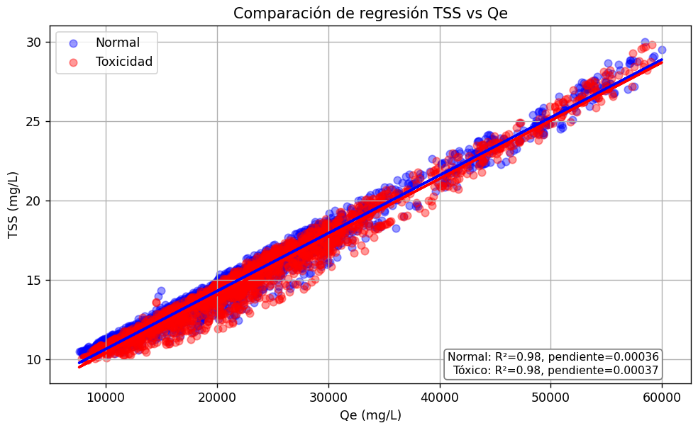

# Ejercicio 1: Regresión Lineal Simple en el BSM2

Este ejercicio explora la linealidad entre variables clave del modelo BSM2 bajo dos condiciones:
- 🟦 Simulación sin fallo (condición normal)
- 🔴 Simulación con fallo por toxicidad

---

## 🔍 Variables estudiadas

Se analiza la posible relación lineal entre las siguientes parejas de variables:

| Variable X (predictora) | Variable Y (respuesta) | Fuente de datos |
|--------------------------|-------------------------|------------------|
| SNO (nitrato)            | SNH (amonio)            | efluente         |
| DQO (TCOD)               | DBO (BOD5)              | efluente         |
| Qe (caudal efluente)     | TSS (sólidos totales)   | efluente         |
| Qe (caudal efluente)     | COD (DQO)               | efluente         |

---

## ⚙️ Tecnología usada

- **MATLAB**: generación de CSV desde simulaciones del BSM2
- **Python**: regresiones con `scikit-learn`, `matplotlib`, `pandas`

---

## 📌 Observaciones

- Se filtran outliers en algunas gráficas (por ejemplo, Qe > 60.000 m³/d)
- Se controla el número de puntos graficados para mejorar la visualización, aplicando un muestreo aleatorio del 1% (`frac=0.01`) o del 0,1% (`frac=0.001`)

---

## 📊 Resultados y conclusiones detalladas

### 🔹 1. DQO → DBO (efluente)

- **R² sin fallo**: 0.6754  
- **R² con toxicidad**: 0.9835

**Conclusión técnica:**

- Cuando el sistema opera con normalidad, los microorganismos degradan parte de la DBO, lo que introduce variabilidad en su relación con la DQO. Esto provoca una **correlación moderada** y no completamente lineal.
- Bajo condiciones de toxicidad, esta actividad biológica se reduce drásticamente. Como consecuencia, la **DBO permanece prácticamente proporcional a la DQO**, manteniendo una relación más estable y lineal similar a la del influente.
- La pendiente de la regresión en este caso se aproxima a la fracción biodegradable teórica del modelo (≈ 0.65), lo que indica que el sistema deja de alterar esa proporción en el tratamiento.

**Aplicación práctica:**

- Este cambio hacia una relación más lineal puede ser un **indicador temprano de fallo por toxicidad o inhibición**.
- Un modelo predictivo entrenado bajo condiciones normales (como una red neuronal o un autoencoder) podría **detectar fácilmente estos cambios estructurales** en las correlaciones entre variables.
- Por tanto, **monitorizar la linealidad entre DQO y DBO podría ayudar a diagnosticar automáticamente fallos en la EDAR** antes de que se manifiesten en los valores absolutos.

### 🔹 2. SNH ↔ SNO (efluente)

- **R² sin fallo**: 0.0007  
- **R² con toxicidad**: 0.8174

**Conclusión técnica:**

- En condiciones normales, el sistema funciona correctamente y el proceso de nitrificación convierte de forma eficiente el amonio (SNH) en nitrato (SNO). Esto da lugar a **valores de SNH muy bajos y estables**, con ligeras fluctuaciones. Como SNO también se mantiene en un rango acotado, **no hay una relación lineal aparente entre ambas variables**.  
  → Resultado: el modelo de regresión no encuentra una pendiente significativa y **R² es prácticamente cero**.

- En cambio, cuando hay toxicidad, los microorganismos nitrificantes se ven afectados y **la conversión de SNH a SNO se interrumpe**. Como consecuencia, el amonio comienza a **acumularse**, mientras que el nitrato disminuye o se estabiliza. Esto genera una **clara relación inversa entre SNH y SNO**, con pendiente negativa pronunciada y un **R² muy alto (0.82)**.  
  → En otras palabras, cuanto menos nitrato, más amonio, lo cual es coherente con una parada de la nitrificación.

### 🔹 3. Qe ↔ TSS (efluente)

### 🔹 3. Qe ↔ TSS (efluente)

- **R² sin fallo**: 0.9762  
- **R² con toxicidad**: 0.9752  
- **Pendiente**: 0.0004 en ambos casos

**Conclusión técnica:**

- Se observa una **relación fuertemente lineal** entre el caudal de efluente (Qe) y la concentración de sólidos totales en suspensión (TSS) tanto en condiciones normales como en presencia de toxicidad.
- La pendiente es baja (≈ 0.0004) debido a que Qe está expresado en valores muy altos (hasta 60.000 m³/día), pero su efecto acumulado es relevante: pequeños aumentos en TSS se explican por grandes cambios en Qe.
- La correlación se mantiene prácticamente idéntica en ambas condiciones, lo cual sugiere que **esta relación no está afectada por el fallo biológico**, sino que refleja fenómenos hidráulicos (como la dilución, arrastre de sólidos o carga hidráulica en el clarificador).

### 🔹 4. Qe ↔ COD (efluente)

- **Tendencia**: leve crecimiento en ambos casos

**Conclusión**:
- Podría haber cierta proporcionalidad entre Qe y la carga orgánica saliente.
- Aun así, la dispersión es elevada y los modelos lineales simples no capturan toda la variabilidad.

---

# Ejercicio 2: Regresión Múltiple en el BSM2
## Ejercicio 3: Clasificación Binaria y Evaluación de Modelos

Este ejercicio consiste en entrenar y evaluar diferentes modelos de clasificación binaria sobre un conjunto de datos con dos clases. Se ha utilizado el dataset **Breast Cancer Wisconsin** de `scikit-learn`, que contiene 30 variables predictoras sobre características de tumores, y una variable objetivo binaria:

- `0`: tumor maligno
- `1`: tumor benigno

---

### 🔍 Objetivo
Comparar el rendimiento de dos modelos:
- **Regresión Logística**
- **Random Forest**

Y evaluar si alguno de ellos sobreajusta.

---

### 📊 Métricas utilizadas

- **Accuracy**: proporción total de aciertos
- **Precision**: proporción de verdaderos positivos sobre todos los positivos predichos
- **Recall**: proporción de verdaderos positivos sobre los positivos reales
- **F1-score**: media armónica entre precision y recall
- **ROC y AUC**: curva y área bajo la curva para comparar rendimiento global
- **Matriz de confusión**: visualización de aciertos y errores por clase

---

### 📈 Resultados obtenidos

#### 🔹 Regresión Logística
- Accuracy (test): **0.9474**
- Precision: **0.9459**
- Recall: **0.9722**
- F1 Score: **0.9589**
- Accuracy (train): **0.9623**
- F1 Score (train): **0.9698**

#### 🔹 Random Forest
- Accuracy (test): **0.9474**
- Precision: **0.9459**
- Recall: **0.9722**
- F1 Score: **0.9589**
- Accuracy (train): **1.0000**
- F1 Score (train): **1.0000**

---

### 🔄 Comparación de modelos
| Modelo             | Accuracy | Precision | Recall | F1 Score | Accuracy (train) | F1 (train) |
|--------------------|----------|-----------|--------|----------|------------------|------------|
| Regresión Logística | 0.9474   | 0.9459    | 0.9722 | 0.9589   | 0.9623           | 0.9698     |
| Random Forest      | 0.9474   | 0.9459    | 0.9722 | 0.9589   | 1.0000           | 1.0000     |

---

### 🧠 Conclusiones

Los resultados muestran que ambos modelos obtienen métricas idénticas en el conjunto de test. Sin embargo, el modelo Random Forest alcanza un 100 % de acierto en entrenamiento, lo que sugiere que ha podido memorizar el conjunto de datos (sobreajuste). Aunque en este caso la diferencia con el rendimiento en test es mínima y no hay señales claras de fallo, en contextos con ruido o mayor complejidad este tipo de comportamiento suele provocar errores de generalización.

Por su parte, la Regresión Logística mantiene una coherencia muy alta entre entrenamiento y test, lo que indica una mejor capacidad de generalización. Es también un modelo más simple e interpretable, lo que lo hace preferible en casos donde se desea entender el proceso de decisión.

El hecho de que ambos modelos den exactamente las mismas métricas en test puede explicarse por la estructura del dataset: los datos están bien etiquetados, son limpios y las clases están separadas de forma clara. En estos casos, distintos algoritmos pueden llegar a las mismas decisiones.

---

### Propuesta de ejercicio

Para obtener una mejor comparación entre modelos, sería recomendable aplicar ambos algoritmos sobre datasets más complejos o con más ruido, donde las diferencias en su comportamiento puedan apreciarse con claridad. Algunos ejemplos de datasets adecuados podrían ser:

- `creditcard.csv` (detección de fraude)
- `loan default` o `telco churn`
- Datos simulados del BSM2 con presencia de fallos operacionales

